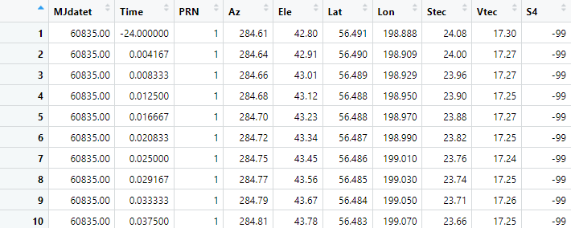
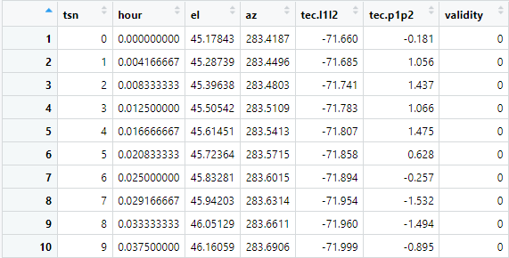
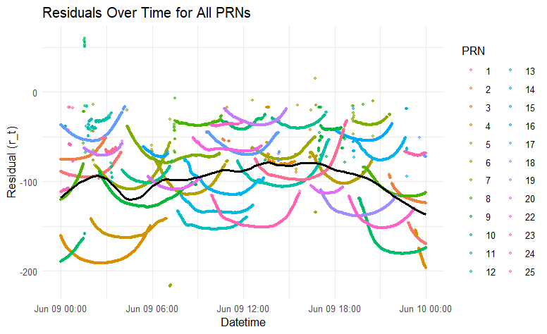
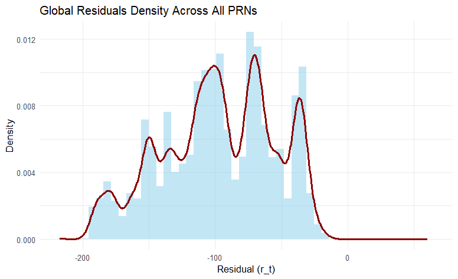

```{r setup, include=FALSE}
knitr::opts_chunk$set(echo = TRUE)
library(dplyr)
library(tidyr)
library(ggplot2)
library(nortest)
library(lubridate)
```

## Osnovne informacije o projektu

-   **Naziv projekta:** Usporedba programskih alata za procjenu ionosferskog kašnjenja GNSS signala
-   **Studenti:** Antonio Cvitković, Luka Ivanić, Lorena Pekić, Rea Prpić
-   **Kodno ime tima:** Tim 8
-   **Profesor:** naslovni prof. dr. sc. Renato Filjar
-   **Ustanova:** Tehnički fakultet u Rijeci
-   **Početak projekta:** 23. svibnja 2025.
-   **Završetak projekta:** 13. lipnja 2025.

Projekt se provodi u sklopu nastave kolegija Programski određen radio s glavnim ciljem dubljeg upoznavanja s programskim okruženjem za statističko računarstvo R, novim programskim alatima (tec-suite i GPS TEC), odgovarajućim knjižnicama te samog procesa planiranja i provedbe projektnog zadatka.

# 1. Uvod

Ukupni sadržaj elektrona u ionosferi (TEC - eng. *Ionospheric Total Electron Content*) ključni je parametar u razumijevanju dinamike ionosfere, koji utječe na širenje signala Globalnog navigacijskog satelitskog sustava (GNSS) i primjene poput navigacije i prognoziranja svemirskog vremena [[1]](#izvori). TEC predstavlja broj slobodnih elektrona duž linije vidljivosti između GNSS prijemnika i satelita, obično mjeren u TEC jedinicama (TECU, $1 , \text{TECU} = 10^{16} , \text{elektrona/m}^2$). Cilj ovog projekta je usporediti dva alata, GPS TEC i tec-suite, za procjenu TEC-a iz GNSS pseudo-udaljenosti, posebno korištenjem GPS podataka iz RINEX datoteke promatranja [[1][2]](#izvori). Usporedba uključuje obradu istog skupa podataka s oba alata, izračunavanje reziduala ($r(t) = \text{TEC}{\text{tec-suite}}(t) - \text{TEC}{\text{GPS TEC}}(t)$) i analizu njihovih statističkih svojstava (kvartili, srednja vrijednost, varijanca, normalnost) radi procjene točnosti i konzistentnosti.

Skup podataka, dobiven s EarthScope Data Servera, sastoji se od RINEX datoteke promatranja (ac121600.25o.Z) sa stanice AC12 9. lipnja 2025. (160. dan) i odgovarajuće GPS navigacijske datoteke (ac121600.25n.Z). Ciljevi su procijeniti performanse GPS TEC-a i tec-suite-a u smislu točnosti procjene TEC-a, jednostavnosti korištenja i kompatibilnosti izlaznih podataka, doprinoseći širem razumijevanju alata za modeliranje ionosfere. Ovo izvješće detaljno opisuje metodologiju za prikupljanje podataka i generiranje TEC procjena, s naglaskom na izazove koji se javljaju pri obradi izlaznih podataka za analizu u R-u.

# 2. Metodologija

## Prikupljanje podataka

RINEX datoteka promatranja ac121600.25o.Z preuzeta je s EarthScope Data Servera (<https://gage-data.earthscope.org/archive/gnss/rinex/obs/2025/160>), koji pruža GNSS podatke za znanstvena istraživanja [[3]](#izvori). Ova komprimirana datoteka, koja se pridržava RINEX 3.04 formata, sadrži mjerenja pseudo-udaljenosti i faze nosača s GPS satelita za stanicu AC12 9. lipnja 2025. Odgovarajuće GPS navigacijske datoteke (ac121600.25n.Z, ac121600.25e.Z, ac121600.25g.Z, ac121600.25h.Z) također su dobivene iz istog izvora kako bi se osigurale satelitske efemeride i korekcije sata potrebne za procjenu TEC-a.

## Korištenje TEC GPS programskog alata

Alat GPS TEC, koji je razvio Gopi Seemala, korišten je za obradu RINEX datoteke promatranja ac121600.25o radi procjene TEC-a. Nakon prilagodbe postavki radi omogućavanja izlaza datoteka, GPS TEC je generirao jednu .Cmn datoteku koja sadrži procjene TEC-a sa stupcima: MJdatet, Time, PRN, Az, Ele, Lat, Lon, Stec, Vtec i S4. Stupac Vtec (vertikalni TEC u TECU) korišten je za usporedbu, izveden iz mjerenja pseudo-udaljenosti (P1/P2) nakon izravnavanja nosioca u kod. Datoteka je uključivala dva retka metapodataka, koji su preskočeni tijekom analize. Na slici 1 vidi se grafičko sučelje samog programa, te izlaz koji prikaže nakon uspješne TEC estimacije. Na lijevoj strani je prikazan graf TEC kroz vrijeme od 24h jednog dana, sa korištenim TECU vrijednostima za TEC i sat za vrijeme. Na desnoj strani je graf TEC (y os) kroz vrijeme (x os) s uklonjenim satelitskim i prijemnim pristranostima. Na slici 2 prikazan je prvotni .Cmn izlaz s neobrađenim podacima.

```{r tecgps-gui, echo=FALSE, fig.width=80, fig.align='center', fig.cap='**Slika 1:** *Prikaz grafičkog sučelja i izlaza programskog alata TEC GPS*'}

knitr::include_graphics("./slike/tecgps-gui.png")
```

```{r tecgps-data, echo=FALSE, out.width = "70%", fig.align='center', fig.cap='**Slika 2:** *Prikaz TEC GPS izlaznih podataka prije obrade*'}


```

## Korištenje tec-suite programskog alata

Alat tec-suite korišten je za obradu iste RINEX datoteke (ac121600.25o) s GPS navigacijskim datotekama (.25n, .25e, .25g i .25h) za generiranje TEC procjena. Tec-suite nema grafičko sučelje već se sastoji od direktorija u kojem su izvršna datoteka te konfiguracijska datoteka gdje se upisuju nazivi direktorija gdje se nalaze potrebne datoteke za izvršenje programa [[2]](#izvori). Za ispravan rad programa potrebno je zasebno instalirati gunzip i crx2rnx koje dekompresiraju kompaktne RINEX datoteke. Navigacijske datoteke smještene su u zasebne direktorije (nav/n, nav/g/, nav/h/ i nav/e/ za GLONASS i SBAS) kako bi se zadovoljili ulazni zahtjevi tec-suitea. Umjesto jedne CSV datoteke, tec-suite je generirao otprilike 37 .dat datoteka, jednu po vidljivom GPS satelitu (npr. G01, G02, ..., G37). Svaka .dat datoteka imala je zaglavlje od 10 redaka s metapodacima (npr. PRN satelita, koordinate lokacije) i stupcima: tsn, sat, el, az, tec.l1l2, tec.p1p2 i valjanost (eng. *validity*). Stupac tec.p1p2 korišten je kao VTEC za usporedbu s Vtec-om GPS TEC-a. Zaglavlje je označavalo podatke odvojene razmacima i format datuma i vremena (%Y-%m-%dT%H:%M:%S), ali retci podataka koristili su tsn (modificirani julijanski datum) i sat (decimalni sati). Na slici 3 prikazani su neobrađeni podaci jedne od .dat datoteke koje je tec-suite izgenerirao.

```{r tesuite_izlaznih_podataka_prije_obrade, echo=FALSE, out.width = "70%", fig.align='center', fig.cap='**Slika 4:** *Prikaz tec-suite izlaznih podataka prije obrade*'}



```

# 3. Rezultati

## Analiza razlike između alata tec-suite i GPS TEC (Gopi)

Cilj analize bio je usporediti učinkovitost dvaju programskih alata za procjenu ukupnog elektronskog sadržaja u ionosferi (TEC): *tec-suite* i *GPS TEC (Gopi)*. Reziduali su definirani kao razlika između njihovih procjena u svakom vremenskom trenutku:

$$
r(t) = TEC_{\text{tec-suite}}(t) - TEC_{\text{GPS TEC}}(t)
$$

Gdje TEC označava *Total Electron Content*, odnosno količinu elektrona po kvadratnom metru između GNSS satelita i prijamnika. Veće vrijednosti TEC-a ukazuju na gušću ionosferu koja više utječe na kašnjenje GNSS signala.

Pozitivan rezidual znači da tec-suite precjenjuje količinu elektrona u odnosu na alat GPS TEC (Gopi), tj. smatra ionosferu gušćom, što može dovesti do pretjeranih korekcija GNSS signala. Nasuprot tome, negativan rezidual ukazuje na podcjenjivanje TEC-a od strane tec-suite, što može rezultirati nedovoljnom korekcijom ionosferskog utjecaja.

Analiza je provedena na podacima istih PRN satelita u istim vremenskim trenucima, koji su preuzeti s EarthScope Data Servera i i obrađeni pomoću modela tec-suite i GPS TEC (Gopi). Time svaki izračunati rezidual precizno prikazuje trenutnu razliku između dvaju modela za isti satelit, u istom trenutku i pod istim uvjetima.

## Vremenska dinamika reziduala

Analiza vremenskog prikaza reziduala za sve PRN satelite pruža pregled cjelokupnog ponašanja razlika između alata tec-suite i GPS TEC (Gopi) kroz promatrano razdoblje. Većina reziduala zadržava se u negativnom području, što ukazuje na tendenciju alata tec-suite da podcjenjuje vrijednosti TEC-a u odnosu na referentni alat.

Na grafu su prikazane pojedinačne točke reziduala kroz vrijeme, dok crna glatka linija vizualizira prosječnu dinamiku odstupanja. Iako ta linija varira tijekom vremena, jasno se vidi da se zadržava ispod nulte vrijednosti, što sugerira prevladavajući negativni pomak u procjenama.

Ovaj vremenski pregled ukazuje da performanse alata nisu potpuno konzistentne kroz cijelo razdoblje, nego pokazuju određene fluktuacije koje su važne za detaljniju interpretaciju i usporedbu modela. Takva vremenska varijabilnost stoga predstavlja ključni kontekst za kasniju statističku analizu po pojedinim PRN satelitima.


```{r vremenska_razlika_reziduala, echo=FALSE, out.width = "70%", fig.align='center', fig.cap='**Slika 4:** *Prikaz individualnih reziduala svih PRN-ova kroz vrijeme*'}



```


## Gustoća globalnih reziduala

Analiza ukupne distribucije reziduala između alata tec-suite i GPS TEC (Gopi) za sve PRN satelite prikazana je histogramom s procijenjenom funkcijom gustoće vjerojatnosti. Na ovom prikazu jasno je vidljivo da su gotovo svi reziduali smješteni u negativnom području, što potvrđuje da tec-suite u velikoj većini slučajeva procjenjuje manji ukupni elektronski sadržaj (TEC) u odnosu na referentni alat GPS TEC (Gopi).

Najveća gustoća reziduala koncentrirana je u rasponu od otprilike -140 do -50, gdje se pojavljuju dva izražena lokalna maksimuma. Međutim, gledajući cijeli raspon distribucije, vidljivo je više manjih vrhova.

Najveća učestalost reziduala zabilježena je u rasponu od -140 do -50, gdje se nalaze dva dominantna vrha. No, gledajući širu raspodjelu, vidljivo je više manjih lokalnih maksimuma, što znači da razlike među alatima nisu raspoređene jednoliko. Takav obrazac s više izraženih područja povećane učestalosti, upućuje na to da razlike između alata nisu ujednačene, već da postoje tipične razine odstupanja koje se češće ponavljaju. Te razine mogu biti povezane s određenim PRN satelitima, vremenskim razdobljima ili promjenjivim ionosferskim uvjetima.

Distribucija nije simetrična ni zvonolikog oblika, već složenija i razgranatija, s više izraženih gustoća. Ovakva raspodjela pruža dublji uvid u ponašanje alata i upućuje na to da odstupanja između modela nisu slučajna, već reflektiraju specifične obrasce i strukturne razlike u procjenama TEC-a.

```{r globalna_statistika, echo=FALSE, out.width = "70%", fig.align='center', fig.cap='**Slika 5:** *Prikaz globalne rezidualne gustoce svih PRN-ova*'}



```

## Globalna deskriptivna statistika

Globalni statistički pokazatelji dodatno potvrđuju sustavnu pristranost modela tec-suite u odnosu na alat GPS TEC (Gopi):

-   **Aritmetička sredina (prosjek)**: −97.4\
-   **Medijan**: −96.9\
-   **Minimum / Maksimum**: −217 / 60.2\
-   **Interkvartilni raspon (IQR)**: 62.1\
-   **Varijanca**: 1790

Ovi pokazatelji jasno potvrđuju da su razlike između alata strukturirane i konzistentno nagnute prema negativnim vrijednostima. Sredina i medijan gotovo identične, zajedno s izraženim minimumom, ukazuju na sustavnu pristranost alata tec-suite. Iako varijanca i IQR upućuju na određenu razinu varijabilnosti, dominacija negativnih vrijednosti ostaje najizraženija statistička karakteristika.

## Statistička analiza reziduala po PRN satelitima

Analiza PRN satelita na temelju statističkih pokazatelja (interkvartilnog raspona (IQR), varijance, položaja medijana i prisutnosti outliera) omogućila je kategorizaciju njihove pouzdanosti u kontekstu usporedbe dvaju alata za procjenu totalnog elektronskog sadržaja (TEC).

Rezultati ukazuju na veliku raznolikost u ponašanju pojedinih PRN satelita, pri čemu se jasno izdvajaju tri osnovne skupine: pouzdani, umjereno pouzdani i nestabilni sateliti.

### Visoko pouzdani PRN-ovi

PRN 4, PRN 13, PRN 18, PRN 20 i PRN 22 pokazali su najveći stupanj stabilnosti i konzistentnosti. Njihove statističke karakteristike – vrlo uski IQR-ovi, niske varijance te simetrična raspodjela reziduala – ukazuju na izrazito kompaktne i uravnotežene podatke. Iako PRN 13 i PRN 18 imaju prisutne outliere u pozitivnom smjeru, oni nisu dovoljno ekstremni da ozbiljno naruše ukupnu stabilnost podataka. PRN 22, iako ima najveći broj outliera među ovom skupinom, ti su outlieri unutar prihvatljivih granica i ne narušavaju osnovnu stabilnost. S druge strane, PRN 4 i PRN 20 gotovo nemaju outliere. U kontekstu usporedbe dvaju alata, ovi PRN-ovi predstavljaju pouzdanu referencu jer, unatoč povremenim odstupanjima, ukupno nude visoku preciznost i dosljednost u procjenama TEC-a.

### Umjereno pouzdani PRN-ovi

U ovu kategoriju svrstavaju se PRN 1, 5, 6, 7, 9, 12, 15, 16, 17, 19 i 25. Ovi sateliti pokazali su umjerene razine varijabilnosti, uz relativno prihvatljive IQR-ove i srednje vrijednosti varijance. U većini slučajeva prisutni su izolirani outlieri – najčešće u pozitivnom smjeru, no bez ozbiljnih posljedica po cjelokupnu raspodjelu. Jezgre distribucija ostaju relativno stabilne, pa se ovi PRN-ovi mogu smatrati korektnom osnovom za usporedbu alata, pod uvjetom dodatnog opreza u tumačenju rezultata.

### Nestabilni i nepouzdani PRN-ovi

PRN 2, 3, 8, 10, 11, 23 i 24 pokazali su široke interkvartilne raspone i visoke varijance, često uz dodatak izraženih outliera i asimetričnih distribucija. PRN 10 i PRN 23 posebno su problematični – s varijancama od preko 4000 i IQR-ovima većim od 100 jedinica, njihove procjene TEC-a između alata značajno odstupaju. Ovi PRN-ovi ne mogu se smatrati pouzdanima za finu procjenu razlika između alata i trebali bi biti isključeni iz statistički osjetljivih interpretacija.

## Test normalnosti

Anderson-Darling test primijenjen na globalni skup reziduala pokazao je vrlo niske p-vrijednosti (sve \< 0.05), što jasno upućuje na to da distribucija reziduala značajno odstupa od normalne. Takav rezultat potvrđuje nepravilnu i nelinearnu strukturu podataka te opravdava primjenu statističkih metoda koje ne ovise o pretpostavci normalnosti. Ova spoznaja dodatno učvršćuje zaključke o neslučajnoj prirodi razlika između alata i potrebi za robusnijim analitičkim pristupima.

# 4. Zaključak

Analiza provedena nad ukupnim skupom reziduala, zajedno s vremenskim pregledom i pojedinačnom analizom po satelitima, jasno pokazuje da alat tec-suite dosljedno daje niže vrijednosti TEC-a u odnosu na referentni alat GPS TEC (Gopi). Takva razlika nije rezultat nasumičnih oscilacija, već proizlazi iz strukturnih karakteristika modela i njihove različite osjetljivosti na podatke i uvjete.

Reziduali su u velikoj većini negativni, s izraženim obrascima i ponavljajućim odstupanjima, što je potvrđeno histogramima gustoće, deskriptivnom statistikom i testom normalnosti. Distribucija odstupanja pokazala se nelinearna i nesimetrična, čime se dodatno ističe složenost razlika između alata. Statistička analiza po PRN satelitima pokazala je značajne razlike u stabilnosti i preciznosti među satelitima, pri čemu su neki PRN-ovi iskazali visoku pouzdanost, a drugi visoku varijabilnost i prisutnost ekstremnih odstupanja.

U cjelini, GPS TEC (Gopi) se ističe kao pouzdaniji i stabilniji alat za procjenu ukupnog elektronskog sadržaja, s izlaznim vrijednostima koje se bolje uklapaju u očekivane obrasce i daju manje oscilacija. Za potrebe budućih analiza, osobito onih koje zahtijevaju visoku preciznost u modeliranju ionosferskih utjecaja na GNSS signale, preporuča se primjena Gopi alata kao primarnog izvora TEC procjena.

# Izvori {#izvori}

1.  GPS TEC Program, Seemala Gopi, mrežna stranica: <https://seemala.blogspot.com/> (pristup: 23.05.2025.)
2.  tec-suite Documentation, tec-suite Developers, mrežna stranica: <https://tec-suite.readthedocs.io/en/latest/> (pristup: 23.05.2025.)
3.  EarthScope GNSS Data Server, EarthScope Consortium, mrežna stranica: <https://gage-data.earthscope.org/> (pristup: 23.05.2025.)
