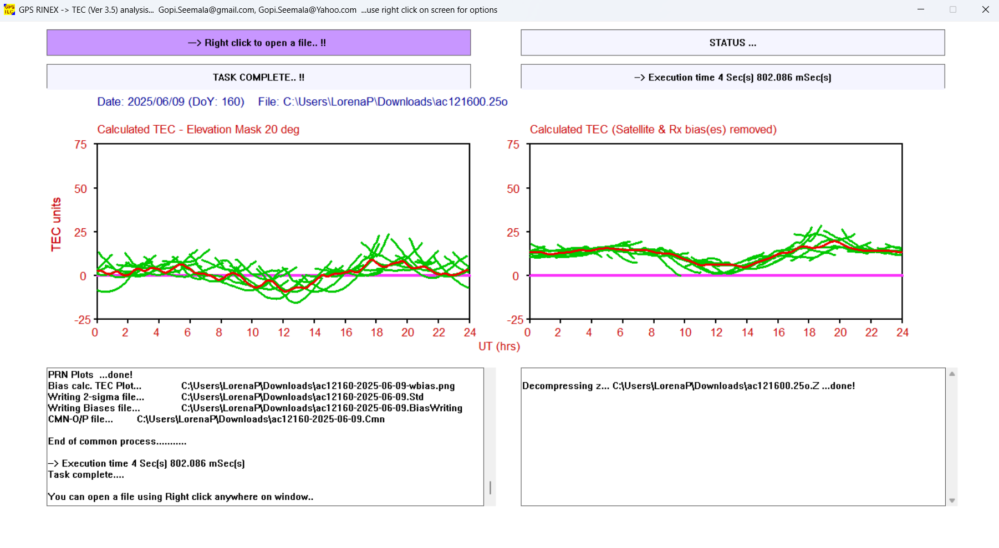

```{r setup, include=FALSE}
knitr::opts_chunk$set(echo = TRUE)
library(dplyr)
library(tidyr)
library(ggplot2)
library(nortest)
library(lubridate)
```


## Osnovne informacije o projektu

- **Naziv projekta:** Usporedba programskih alata za procjenu ionosferskog kašnjenja GNSS signala
- **Studenti:** Antonio Cvitković, Luka Ivanić, Lorena Pekić, Rea Prpić
- **Kodno ime tima:** Tim 8
- **Profesor:** naslovni prof. dr. sc. Renato Filjar
- **Ustanova:** Tehnički fakultet u Rijeci
- **Početak projekta:** 23. svibnja 2025.
- **Završetak projekta:** 13. lipnja 2025.

Projekt se provodi u sklopu nastave kolegija Programski određen radio s glavnim ciljem dubljeg upoznavanja s programskim okruženjem za statističko računarstvo R, novim programskim alatima (tec-suite i GPS TEC), odgovarajućim knjižnicama te samog procesa planiranja i provedbe projektnog zadatka.

# 1. Uvod

Ukupni sadržaj elektrona u ionosferi (TEC - eng. *Ionospheric Total Electron Content*) ključni je parametar u razumijevanju dinamike ionosfere, koji utječe na širenje signala Globalnog navigacijskog satelitskog sustava (GNSS) i primjene poput navigacije i prognoziranja svemirskog vremena [[1]](#izvori). TEC predstavlja broj slobodnih elektrona duž linije vidljivosti između GNSS prijemnika i satelita, obično mjeren u TEC jedinicama (TECU, $1 , \text{TECU} = 10^{16} , \text{elektrona/m}^2$). Cilj ovog projekta je usporediti dva alata, GPS TEC i tec-suite, za procjenu TEC-a iz GNSS pseudo-udaljenosti, posebno korištenjem GPS podataka iz RINEX datoteke promatranja [[1]](#izvori)[[2]](#izvori). Usporedba uključuje obradu istog skupa podataka s oba alata, izračunavanje reziduala ($r(t) = \text{TEC}{\text{tec-suite}}(t) - \text{TEC}{\text{GPS TEC}}(t)$) i analizu njihovih statističkih svojstava (kvartili, srednja vrijednost, varijanca, normalnost) radi procjene točnosti i konzistentnosti.

Skup podataka, dobiven s EarthScope Data Servera, sastoji se od RINEX datoteke promatranja (ac121600.25o.Z) sa stanice AC12 9. lipnja 2025. (160. dan) i odgovarajuće GPS navigacijske datoteke (ac121600.25n.Z). Ciljevi su procijeniti performanse GPS TEC-a i tec-suite-a u smislu točnosti procjene TEC-a, jednostavnosti korištenja i kompatibilnosti izlaznih podataka, doprinoseći širem razumijevanju alata za modeliranje ionosfere. Ovo izvješće detaljno opisuje metodologiju za prikupljanje podataka i generiranje TEC procjena, s naglaskom na izazove koji se javljaju pri obradi izlaznih podataka za analizu u R-u.

# 2. Metodologija


## Prikupljanje podataka

RINEX datoteka promatranja ac121600.25o.Z preuzeta je s EarthScope Data Servera ([https://gage-data.earthscope.org/archive/gnss/rinex/obs/2025/160](https://gage-data.earthscope.org/archive/gnss/rinex/obs/2025/160)), koji pruža GNSS podatke za znanstvena istraživanja [[3]](#izvori). Ova komprimirana datoteka, koja se pridržava RINEX 3.04 formata, sadrži mjerenja pseudo-udaljenosti i faze nosača s GPS satelita za stanicu AC12 9. lipnja 2025. Odgovarajuće GPS navigacijske datoteke (ac121600.25n.Z, ac121600.25e.Z, ac121600.25g.Z, ac121600.25h.Z) također su dobivene iz istog izvora kako bi se osigurale satelitske efemeride i korekcije sata potrebne za procjenu TEC-a.

## Korištenje TEC GPS programskog alata
Alat GPS TEC, koji je razvio Gopi Seemala, korišten je za obradu RINEX datoteke promatranja ac121600.25o radi procjene TEC-a. Nakon prilagodbe postavki radi omogućavanja izlaza datoteka, GPS TEC je generirao jednu .Cmn datoteku koja sadrži procjene TEC-a sa stupcima: MJdatet, Time, PRN, Az, Ele, Lat, Lon, Stec, Vtec i S4. Stupac Vtec (vertikalni TEC u TECU) korišten je za usporedbu, izveden iz mjerenja pseudo-udaljenosti (P1/P2) nakon izravnavanja nosioca u kod. Datoteka je uključivala dva retka metapodataka, koji su preskočeni tijekom analize.
Na slici 1 vidi se grafičko sučelje samog programa, te izlaz koji prikaže nakon uspješne TEC estimacije. Na lijevoj strani je prikazan graf TEC kroz vrijeme od 24h jednog dana, sa korištenim TECU vrijednostima za TEC i sat za vrijeme. Na desnoj strani je graf TEC (y os) kroz vrijeme (x os) s uklonjenim satelitskim i prijemnim pristranostima.

```{r tecgps-gui, echo=FALSE, fig.width=80, fig.align='center', fig.cap='1.*Prikaz grafičkog sučelja i izlaza programskog alata TEC GPS*'}


```


## Korištenje tec-suite programskog alata
Alat tec-suite korišten je za obradu iste RINEX datoteke (ac121600.25o) s GPS navigacijskim datotekama (.25n, .25e, .25g i .25h) za generiranje TEC procjena. Tec-suite nema grafičko sučelje već se sastoji od direktorija u kojem su izvršna datoteka te konfiguracijska datoteka gdje se upisuju nazivi direktorija gdje se nalaze potrebne datoteke za izvršenje programa [[2]](#izvori). Za ispravan rad programa potrebno je zasebno instalirati gunzip i crx2rnx koje dekompresiraju kompaktne RINEX datoteke. Navigacijske datoteke smještene su u zasebne direktorije (nav/n, nav/g/, nav/h/ i nav/e/ za GLONASS i SBAS) kako bi se zadovoljili ulazni zahtjevi tec-suitea. Umjesto jedne CSV datoteke, tec-suite je generirao otprilike 37 .dat datoteka, jednu po vidljivom GPS satelitu (npr. G01, G02, ..., G37). Svaka .dat datoteka imala je zaglavlje od 10 redaka s metapodacima (npr. PRN satelita, koordinate lokacije) i stupcima: tsn, sat, el, az, tec.l1l2, tec.p1p2 i valjanost (eng. *validity*). Stupac tec.p1p2 korišten je kao VTEC za usporedbu s Vtec-om GPS TEC-a. Zaglavlje je označavalo podatke odvojene razmacima i format datuma i vremena (%Y-%m-%dT%H:%M:%S), ali retci podataka koristili su tsn (modificirani julijanski datum) i sat (decimalni sati).


# Izvori

1. GPS TEC Program, Seemala Gopi, mrežna stranica: [https://seemala.blogspot.com/](https://seemala.blogspot.com/) (pristup: 23.05.2025.)
2. tec-suite Documentation, tec-suite Developers, mrežna stranica: [https://tec-suite.readthedocs.io/en/latest/](https://tec-suite.readthedocs.io/en/latest/) (pristup: 23.05.2025.)
3. EarthScope GNSS Data Server, EarthScope Consortium, mrežna stranica: [https://gage-data.earthscope.org/](https://gage-data.earthscope.org/) (pristup: 23.05.2025.)